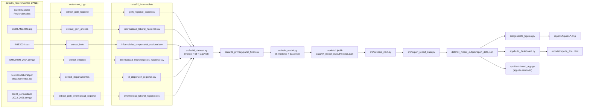

# Arquitectura e integración de fuentes

## Diagrama de flujo

## Por qué esta estructura de `data/`

Sigue el patrón *raw → intermediate → primary → model output*, para que
cada capa tenga una responsabilidad clara y sea fácil saber qué se puede
borrar y regenerar (todo lo que no está en `01_raw/` se reconstruye
corriendo `pipelines/pipeline_ml.py`):

- **01_raw**: exactamente como llegó del DANE (comprimido donde hacía
  falta para caber en GitHub). Nunca se edita a mano.
- **02_intermediate**: una fuente ya limpia y homologada a semestre, pero
  todavía **sin combinar** con las demás.
- **03_primary**: el panel único, ya combinado, con todas las features de
  historia reciente. Es lo que entra a `train_model.py`.
- **04_model_output**: todo lo que sale de entrenar/evaluar/proyectar
  (menos el modelo serializado en sí, que vive en `models/` porque
  conceptualmente es un artefacto distinto a un dato tabular).

## Por qué `src/` tiene 6 extractores en vez de 1 solo

Cada fuente tiene un formato de origen distinto (Excel con hoja pivotante,
zip con Excel adentro, CSV plano, microdato de 3.7M filas) y una lógica de
limpieza propia y no trivial (ver docstring de cada script). Forzarlos a
un único `data_cleaning.py` habría escondido esa complejidad en vez de
hacerla explícita; se prefirió una función/script por fuente, todas
important­ables desde `pipelines/pipeline_ml.py`.

## Cómo se resuelven las rutas

`src/config.py` es la única fuente de verdad para las rutas del proyecto
(`RAW_DIR`, `INTERMEDIATE_DIR`, `PRIMARY_DIR`, `MODEL_OUTPUT_DIR`,
`MODELS_DIR`, `REPORTS_DIR`), calculadas desde la ubicación del propio
`config.py`. Todo lo demás (extractores, `build_dataset.py`,
`train_model.py`, la app de escritorio) importa de ahí — mover o renombrar
una carpeta de datos solo implica editar ese archivo.
